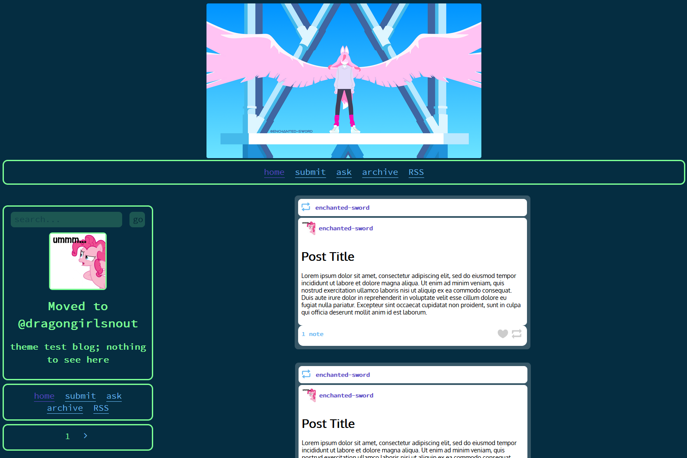

# melody-theme

melody is a sleek, simple theme for tumblr that is easily editable to suit your needs. It uses a series of simple flex containers that even a novice in web design can easily work with, and all the code is contained within one `html` file.

## Features
- Tag, search, and day pages
- Blog view link button for ease of editing your posts
- Following list
- Header size adaptability
- Reblog header with blog preview
- Support for narrower screens

## Installation
Simply copy the contents of `main.html` into the custom theme html section on the blog customization page

## Basic customization
Without touching the code, you can still customize your page to a degree by changing your background color, title color, and accent color, as well as adding a header image.

### Background Color
Used for:
- The main container background
- The ask background

Avoid white, and other similarly light colors, unless you plan on modifying the hard-coded post colors.

### Title Color
Used for:
- Borders around the navigation cards
- All non-post or link text in the theme

Any colors that contrast sufficiently with the background color will do

### Accent Color
Used for:
- Links
- User URLS
- Blog view link button
- The reblog icon in the reblog header
- The note count in the post footer

Avoid white, and other similarly light colors, unless you plan on modifying the hard-coded post colors. Additionally, it is reccomended, but not necessary to chose a different color from the title color.

### Header Image
The header image that displays at the top of the page will display your header image at its original aspect ratio, scaled down to 360px in height. If you're looking to have the header take up the full width of the page without modifying the code, use an an image with an 11 : 2 aspect ratio (assuming a 1080p display).
